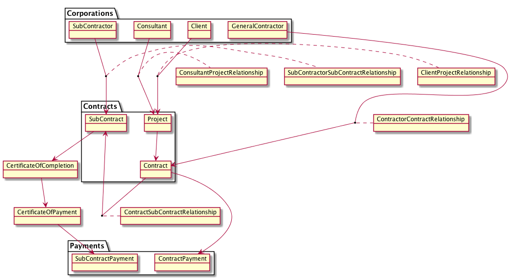

# BCCA Payment Hub POC

Ensure prompt payment and payment transparency

## Running the demo

1. Open separate shells and run the following, in order:

```
git clone https://github.com/bcgov/von-network.git
cd von-network
./manage build
./manage start
```

```
git clone https://github.com/bcgov/bcca-payment-hub.git
cd bcca-payment-hub/starter-kit/credential-registry/docker
TOB_THEME_PATH=<your dir>/bcca-payment-hub/starter-kit/credential-registry/client/tob-web/themes/ TOB_THEME=bcgov ./manage build
TOB_THEME=bcgov ./manage start seed=my_seed_000000000000000000000123
```

```
git clone https://github.com/bcgov/greenlight.git
cd greenlight/docker
./manage build
./manage start
```

```
cd bcca-payment-hub/starter-kit/agent/docker
./manage build
./manage start
```

2. Once the above apps have finished starting up (hint: "Indy synced"), in yet another shell:

```
cd bcca-payment-hub/starter-kit/agent/bcca-agent
./load-creds.sh
```

This will load sample data.

Now open https://localhost:8080/ in a browser, search for "Ministry of Education", and follow the links.

3. Credentials are based on the following model:



(Note that Project and Contract are collapsed into one credential.)

